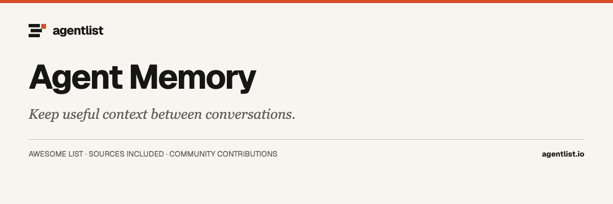

  

# Awesome Agent Memory

  

> Persistent memory, recall, knowledge graphs, and context tools for AI agents.

12 projects · Upstream documentation checked 2026-09-29. Curated by [agentlist.io](https://www.agentlist.io).

**Help your agent pick up where you left off.**

Start with what your agent keeps forgetting. Resuming a conversation, remembering project decisions, learning personal preferences, and sharing knowledge across a team are different jobs. Choose a memory tool for the information you need to preserve and the place you need to recall it.

Tools with an explicit agent-memory or persistent-context interface. General databases and document search engines are excluded unless the linked project supplies an agent-facing memory layer.

## Contents

- [How to choose](#how-to-choose)
- [Memory services and frameworks](#memory-services-and-frameworks)
- [Graph and file-based recall](#graph-and-file-based-recall)
- [Agent-integrated memory](#agent-integrated-memory)
- [Related awesome lists](#related-awesome-lists)
- [More from Agentlist](#more-from-agentlist)
- [Contributing](#contributing)

## How to choose

- Works with: Is there a documented integration for your agent, or will you need to build one using an SDK, API, or MCP server?
- Runs where: Where are memories stored and processed? Can you operate the storage and retrieval service yourself?
- Needs access to: Does it ingest selected notes, conversations, repository files, or every tool interaction? Can you control what is captured?
- Keeps what: Does it preserve transcripts, facts, relationships, preferences, or procedures? Can you inspect, correct, export, and delete them?
- Human involvement: Who decides what becomes a memory, when it is recalled, and when outdated information is removed?
- Main limitation: How will you detect irrelevant recall, conflicting memories, or information leaking between projects and users?

Use these questions to narrow your shortlist. An entry’s source link records the documentation used for its description; it does not mean every question above has been answered or tested. Treat undocumented capabilities as unknown, and confirm requirements against the linked project before adopting it.

## Memory services and frameworks

- [Cognee](https://github.com/topoteretes/cognee) - Memory platform that turns documents, code, and conversations into searchable knowledge graphs. **Memory platform.**
- [Hindsight](https://github.com/vectorize-io/hindsight) - Agent-memory system with operations for retaining, recalling, and reflecting on information. **Memory server.**
- [LangMem](https://github.com/langchain-ai/langmem) - Python tools for extracting memories from conversations and managing long-term agent context. **Library.**
- [Mem0](https://github.com/mem0ai/mem0) - Memory layer for retaining user and agent context across interactions. **SDK and managed service.**
- [Memobase](https://github.com/memodb-io/memobase) - User-profile memory backend for organizing and retrieving context from conversations. **Memory backend.**
- [Redis Agent Memory](https://github.com/redis/agent-memory-server) - Redis-backed memory service for recalling facts, events, and preferences across sessions. **Managed service.**
- [Supermemory](https://github.com/supermemoryai/supermemory) - Memory and context engine for retaining and retrieving information across AI interactions. **Memory platform.**

## Graph and file-based recall

- [Basic Memory](https://github.com/basicmachines-co/basic-memory) - MCP knowledge system that stores persistent context in local Markdown files. **MCP server.**
- [Graphiti](https://github.com/getzep/graphiti) - Framework for building and querying temporal knowledge graphs for agent context. **Graph library.**
- [Qdrant MCP Server](https://github.com/qdrant/mcp-server-qdrant) - Official MCP server exposing a semantic memory layer backed by Qdrant. **MCP server.**

## Agent-integrated memory

- [claude-mem](https://github.com/thedotmack/claude-mem) - Captures agent-session activity and retrieves relevant context for later sessions. **Agent integration.**
- [Letta Code](https://github.com/letta-ai/letta-code) - Stateful agent harness with persistent memory and an app server for connected interfaces. **Agent harness.**

## Related awesome lists

Independent collections for deeper discovery. These are references, not affiliations or endorsements.

- [Anandesh-Sharma/awesome-agentic-memory](https://github.com/Anandesh-Sharma/awesome-agentic-memory) - Memory frameworks, research, and benchmarks.
- [TeleAI-UAGI/Awesome-Agent-Memory](https://github.com/TeleAI-UAGI/Awesome-Agent-Memory) - Systems and papers about long-term agent memory.
- [Shichun-Liu/Agent-Memory-Paper-List](https://github.com/Shichun-Liu/Agent-Memory-Paper-List) - Research companion to an agent-memory survey.

## More from Agentlist

- [Awesome Agent List](https://github.com/AgentListIO/awesome-agent-list)
- [Awesome Personal Assistants](https://github.com/AgentListIO/awesome-personal-assistants)
- [Awesome Agent Clients](https://github.com/AgentListIO/awesome-agent-clients)
- [Awesome Agent Sandboxes](https://github.com/AgentListIO/awesome-agent-sandboxes)
- [Awesome Agent Orchestration](https://github.com/AgentListIO/awesome-agent-orchestration)
- [Awesome Agent Observability](https://github.com/AgentListIO/awesome-agent-observability)

**[Browse agents](https://www.agentlist.io/list-of-ai-agents) · [Compare agents](https://www.agentlist.io/compare) · [GitHub organization](https://github.com/AgentListIO)**

## Contributing

Missing something useful? Read the [contribution guide](CONTRIBUTING.md) and open an issue or pull request with an official source.

The machine-readable [list.json](list.json) includes a primary-source link and a documentation-check date for every entry. Descriptions are editorial summaries of upstream documentation; inclusion does not imply hands-on testing, a security audit, or endorsement. Hosted services and source code may have different terms.

To update the list, edit `list.json`, run `bun run build`, then `bun run check`. The README is generated; avoid editing it directly.

[CC0](LICENSE) applies to this list’s text and data. Linked projects retain their own licenses.
